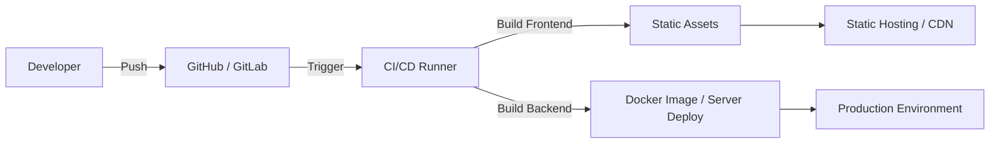

# Deployment & CI/CD Pipeline: KConnect

## 1. Source Control
- Repository managed via Git.
- **Branches:**
  - `main`: Production-ready code.
  - `dev`: Active development branch.
  - `feature/*`: Specific feature branches.

## 2. Build Pipeline
The build pipeline involves two distinct build processes:

### Frontend (Vite/React)
- **Dependency Installation:** `npm install`
- **Linting:** Standard ESLint checks (`npm run lint`).
- **Build:** `npm run build`. Compiles React code into static assets (HTML/CSS/JS) output in the `dist/` directory.

### Backend (Node.js)
- **Dependency Installation:** `npm install`
- Environment Variables setup (`.env.production`).

## 3. Deployment Flow

## 4. Production Deployment Strategy
Currently, KConnect can be deployed using standard PaaS providers:

### Frontend
- Hosted on Vercel, Netlify, or similar static hosting platforms.
- Configured to route all paths to `index.html` (SPA fallback).

### Backend
- Hosted on Render, Heroku, or Google Cloud Run.
- **Environment Variables required:** `MONGO_URI`, `JWT_SECRET`, `PORT`, `FRONTEND_URL` (for CORS).
- Connects to a cloud database (MongoDB Atlas).

## 5. Future CI/CD Enhancements
- Implement automated testing (Jest / React Testing Library).
- Create GitHub Actions workflows to automate the build and deploy steps on PR merges.
- Dockerize the application for consistent environment deployments.

---

## 6. Room Execution Pipeline
When a user enters a video calling room, the application follows a strict execution pipeline to establish media streams.

### Phase 1: Authorization & Local Setup
1. **Meeting Verification:** Frontend calls `POST /api/meetings/join` to verify the meeting ID exists, is active, and the password (if any) is correct.
2. **Host Detection:** The API response identifies whether this user is the host. Stored in `isHost` state.
3. **Room Mount:** `Room.jsx` component mounts and creates a Socket.io connection to the backend.
4. **TURN Credential Fetch:** Frontend calls `GET /api/turn` to fetch Metered TURN server credentials for NAT traversal. Falls back to public STUN servers if unavailable.
5. **Media Access:** Application requests webcam and microphone permissions via `navigator.mediaDevices.getUserMedia()`.
6. **Local Stream:** The browser attaches the local media stream to a muted `<video>` element on the screen.

### Phase 2: Admission & Signaling Handshake
1. **Host Path:** Host emits `join room` directly. Server adds them to the room map and responds with `all users` (empty array if first).
2. **Participant Path:** Non-host emits `request admission`. Server adds them to a pending queue and notifies the host via `admission request`. The participant sees a "Waiting Room" overlay.
3. **Host Admits:** Host clicks Admit → server emits `admitted` to the participant → participant then emits `join room`.
4. **User Discovery:** Server responds to the new joiner with `all users`, containing the Socket IDs of all participants already in the room.
5. **Offer Generation:** For every existing user, the new user creates a `simple-peer` WebRTC instance (`initiator: true`) and generates a connection Offer.
6. **Sending Signal:** The new user transmits this Offer to the existing users via the server.

### Phase 3: Peer Connection
1. **Answer Generation:** Existing users receive the Offer, create a `simple-peer` instance (`initiator: false`), generate an Answer, and send it back via the server.
2. **Signal Return:** The new user receives the Answer and completes the WebRTC handshake.
3. **Stream Attachment:** The `VideoStream` component is the sole consumer of the `stream` event. Remote media streams are received and attached to dynamic `<video>` elements via React state in the CSS Grid layout.

### Phase 4: In-Call Features
1. **Mute/Video Toggle:** When a user toggles mute or camera, the frontend emits `toggle mute` / `toggle video` to the server, which broadcasts to the room. Remote peers display a red `MicOff` icon or avatar overlay accordingly.
2. **Screen Sharing:** Replaces the video track in all existing peer connections using `peer.replaceTrack()`.
3. **Chat:** Messages emitted via `send message` are broadcast to the Socket.io room.

### Phase 5: Exit & Cleanup
1. **Explicit Leave:** On leave/end, the frontend emits `leave room` to the server **before** disconnecting the socket. This triggers immediate server-side cleanup instead of waiting for TCP timeout.
2. **Peer Destruction:** All `simple-peer` instances are destroyed, stopping WebRTC connections.
3. **Track Cleanup:** All media tracks (camera, mic, screen) are stopped.
4. **Host End Meeting:** Host can end the meeting for everyone by calling `POST /api/meetings/:id/end` + emitting `end meeting`. All participants receive `meeting ended` and are navigated to the dashboard.

