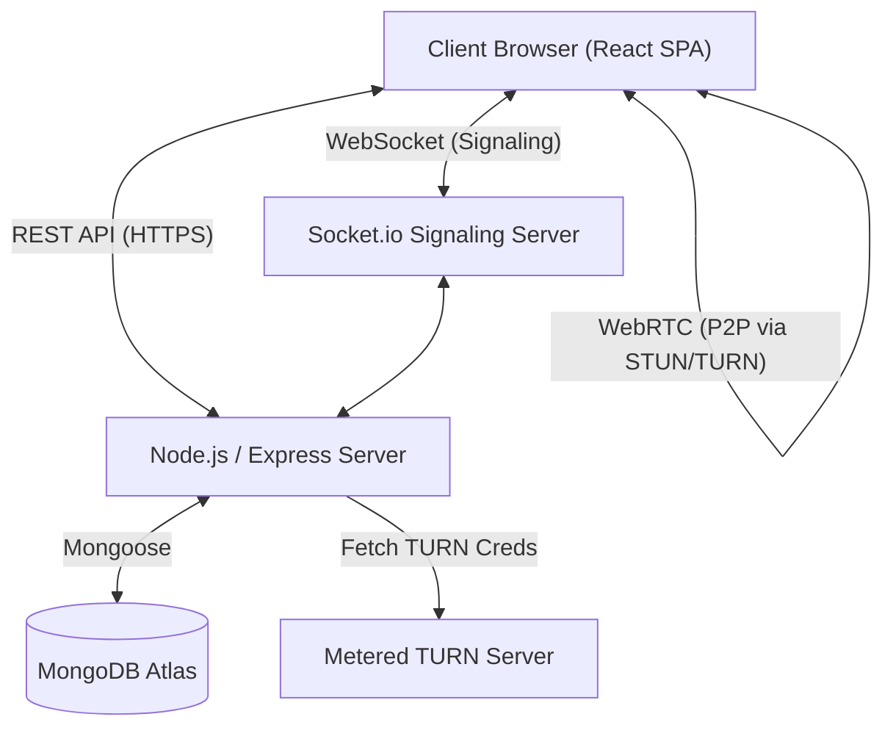

# System Design: KConnect

## 1. Overview
KConnect is a real-time video calling platform. It leverages WebRTC for peer-to-peer video streaming and WebSockets for signaling. The system uses a MERN (MongoDB, Express, React, Node.js) stack to manage user authentication, scheduling, and room generation.

## 2. High-Level Architecture
The architecture comprises four main components:
1. **Frontend (Client):** React SPA (Vite) providing the user interface, video rendering, and state management via Context API.
2. **Backend (Server):** Node.js/Express server handling REST API requests (auth, meetings, TURN credentials) and WebSocket connections for WebRTC signaling.
3. **Database:** MongoDB Atlas for persistent storage of user credentials and meeting metadata.
4. **TURN Server:** Metered.ca hosted TURN relay for NAT traversal when direct P2P connections fail.

## 3. Real-Time Networking
We use a Mesh topology for video streaming:
- **Signaling Layer:** Coordinated by Socket.io. Clients exchange session descriptions (Offers/Answers) and ICE candidates.
- **Media Layer:** Direct Peer-to-Peer connection using WebRTC (`simple-peer`). The server does not relay video/audio data.
- **NAT Traversal:** ICE config fetched from `/api/turn` endpoint. Uses Metered TURN relay as fallback when STUN-only connections fail (e.g., symmetric NAT, mobile data).

## 4. Database Schema
- **User:**
  - `_id`: ObjectId
  - `name`: String
  - `email`: String (Unique)
  - `password`: String (Hashed via bcrypt)
  - `profilePicture`: String
  - `createdAt`: Timestamp
- **Meeting:**
  - `_id`: ObjectId
  - `meetingId`: String (Unique) — custom or auto-generated
  - `title`: String
  - `host`: ObjectId (Ref: User)
  - `participants`: [ObjectId] (Ref: User)
  - `password`: String (optional, plaintext)
  - `status`: Enum ['active', 'ended']
  - `isScheduled`: Boolean
  - `startTime`: Date
  - `createdAt`: Timestamp

## 5. Security & Authentication
- Passwords hashed using `bcrypt`.
- Authentication handled via JSON Web Tokens (JWT).
- Protected API routes enforce JWT verification via `auth.js` middleware.
- Protected React routes enforce Auth Context state.
- Meeting passwords provide an optional access control layer.
- **Waiting Room / Admission System:** Non-host participants must be explicitly admitted by the host before joining the WebRTC mesh.

## 6. Socket.io Event Map
| Event | Direction | Purpose |
|---|---|---|
| `request admission` | Client → Server | Non-host asks to join |
| `admission request` | Server → Host | Notify host of pending user |
| `admit user` / `deny user` | Host → Server | Host approves/rejects |
| `admitted` / `denied` | Server → Client | Inform participant of decision |
| `join room` | Client → Server | Enter the WebRTC signaling room |
| `all users` | Server → Client | List of existing peers in room |
| `sending signal` | Client → Server | Forward WebRTC Offer |
| `user joined` | Server → Client | Deliver Offer to existing peer |
| `returning signal` | Client → Server | Forward WebRTC Answer |
| `receiving returned signal` | Server → Client | Deliver Answer to initiator |
| `leave room` | Client → Server | Explicit room exit (instant cleanup) |
| `user left` | Server → Client | Notify peers of departure |
| `toggle mute` | Client → Server | Broadcast mute status |
| `toggle video` | Client → Server | Broadcast camera status |
| `user toggled mute` | Server → Client | Remote mute indicator update |
| `user toggled video` | Server → Client | Remote camera indicator update |
| `send message` | Client → Server | In-call chat message |
| `end meeting` | Host → Server | End meeting for all |
| `kick user` | Host → Server | Remove a participant |

## 7. Room State Management (Server)
The server maintains four in-memory maps:
- `rooms{}` — `roomId → [{ socketId, userId, username, isHost }]`
- `pendingUsers{}` — `roomId → [{ socketId, userId, username }]`
- `socketToRoom{}` — `socketId → roomId`
- `socketToUser{}` — `socketId → { userId, username }`

Deduplication is enforced by `userId` on `join room` to prevent ghost entries from stale sockets.
